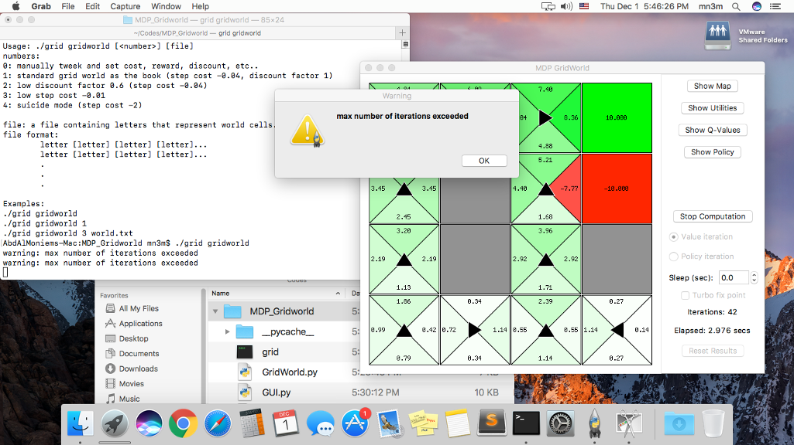

# MDP GridWorld
A simple artificial intelligence MDP to find the optimal policy of a given map.



### Installation:
1. Install `Python3` on your computer.
```shell
sudo apt-get install python3
```

2. Install `Python3's Tkinter` on your computer.
```shell
sudo pip3 install tkinter
```

3. Clone/download this folder to your computer.

4. give the file `mdp_grid_world` permissions to execute.
```shell
chmod a+x mdp_grid_world
```

5. run `./mdp_grid_world` within this folder to show the help message.


### Implementation:
All the implementation was done using `Python3`, with the `Tkinter` module (a module that facilitates GUI development in python).

There are a few files in the project:

- `mdp_grid_world`: this is the main/launch file, it ties all the other files together.

- `GUI.py`: Has two sub-classes that defines the aspects and aesthetics of the graphical interface like buttons, checkboxes, etc... one class opens the rules settings window and the other opens the main windows.

- `GridWorld.py`: A class that defines a grid object with cells and colors and cell types, used by the GUI class to represent the world.

- `Policy.py`: This the brains of the project, it implements both the value and policy iterations to solve the grid.

- `world.txt`: An optional file that enables the user to define his own grid to better understand the MDP process. It could be named anything as long as it is passed correctly to the main program.


### How to Load a grid world file:
1. Create a file and name it anything, say `world.txt` and open it.

2. Layout your grid as lowercase letters:
	
	2.1 `v` means  a void cell.
	
	2.2 `w` means  a wall cell.
	
	2.3 `e` means  an exit cell.
	
	2.4 `p` means  a pit cell.

3. run the program passing the file's name as an argument:
```shell
./mdp_grid_world world.txt
```

4. Example of a `world.txt` file:
	
	v v v e
	
	v w v p
	
	v w v w
	
	v v v v